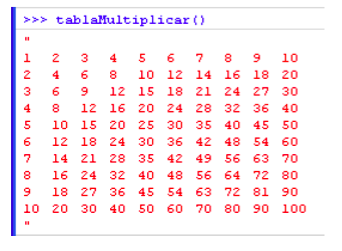

## Javascript Exercises 

- https://developer.mozilla.org/es/docs/Web/API/Console/log

### Integer Numbers Range

Write a function in Javascript that having two integers `x1` and `x2` returns all the integers between them. If `x2` es lower than `x1` it should return -1

### Multiplications table

Write a function that writes in the console the multiplication table (from 1 to 10)

_Hint: https://msdn.microsoft.com/en-us/library/2yfce773(v=vs.94).aspx_

### Multiplications table on demand

Write a function that writes in the console the multiplication table (in one column) of any number passed as parameter

### Calculation

Write a program that writes in the console all the multiples of 23 less than 500 and at the end writes the sum of all of them

    Elements : 0 23 46 69 92 115 138 161 184 207 230 253 276 299 322 345 368
    391 414 437 460 483
    Sum : 5313

### `max()` function

Define a function max() that takes two numbers as arguments and returns the largest of them. Use the if-then-else construct available in Javascript.

### `maxOfThree()` function

Define a function maxOfThree() that takes three numbers as arguments and returns the largest of them.

### `isVowel()` function

Write a function that takes a character (i.e. a string of length 1) and returns true if it is a vowel, false otherwise.

### Hexadecimal 

Writes a function that convert a hexadecimal color, "blue" for example "#0000FF" in its RGB representation rgb(0,0,255)". Give the function the name getRGB() and test it with this code

_Hint: https://developer.mozilla.org/en/JavaScript/Reference/Global_Objects/String/split_

    >>> var a = getRGB ('#00FF00');
    >>> a;
    “rgb(0,255,0)”;

### Hexadecimal enhanced

Improves the previous function so besides the conversion also identifies some basic colors:
- Black: #000000
- White: #FFFFFF
- Red: #FF0000
- Green: #00FF00
- Blue: #0000FF

So the result can be (for these cases):

    >>> var a = getRGB ('#00FF00'); 
    >>> a;
    “rgb(0,255,0)   verde”;