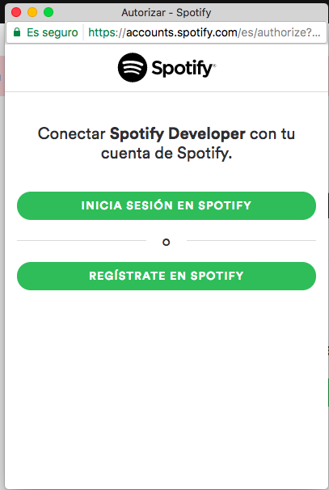
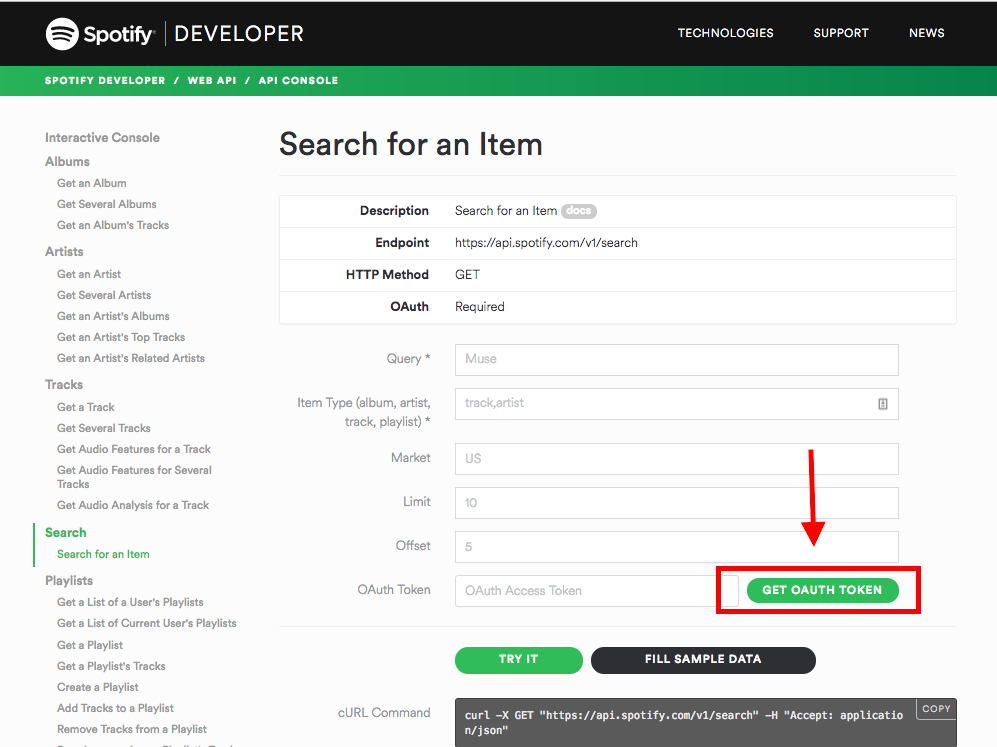
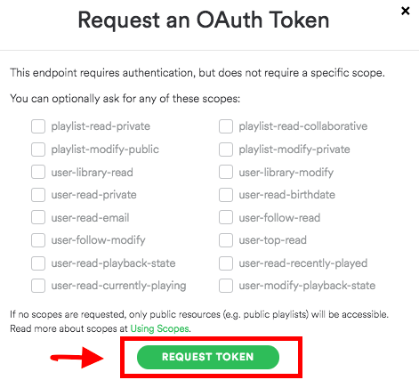
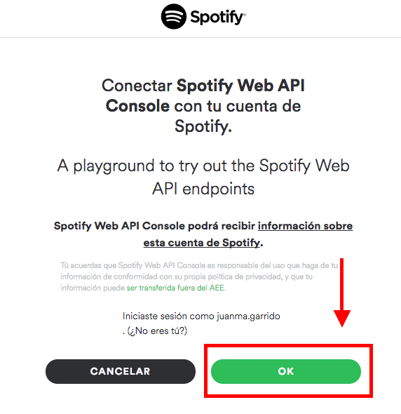
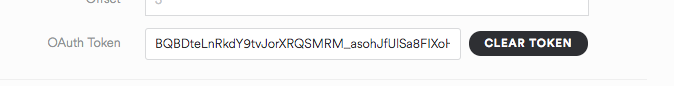

# Challenge. Spotify API

Create an app that:

- Allow us to search for an artist
- It should show a list of artists found
- When clicking an artist it should show a list of albums
- When clicking an album it should show a list of tracks
- When clicking a track it should reproduce a preview of the song (30'')

Resources:
- __https://developer.spotify.com/web-api/__
    + https://developer.spotify.com/web-api/search-item/
    + https://developer.spotify.com/web-api/get-artists-albums/
    + https://developer.spotify.com/web-api/get-albums-tracks/

Hints: 
```
    dataType: "json"
    https://api.spotify.com/v1/search?type=artist&query=<ARTIST-NAME>
    https://api.spotify.com/v1/artists/<ID-ARTIST>/albums
    https://api.spotify.com/v1/albums/<ID-ALBUM>/tracks
```

--------

***Update 18th July 2017***

From [29th May 2017 The Spotify API will require an access token](https://developer.spotify.com/news-stories/2017/01/27/removing-unauthenticated-calls-to-the-web-api/)

To get this token you have to

1- Go to ["My Applications" in Spotify Developer ](https://developer.spotify.com/my-applications/#!/)


2- Log In (click **LOGIN**) to using your normal user or create a new one if you don't have it



3- Log In (or Register first if you don't have an user)

4- [Go to the Sandbox](https://developer.spotify.com/web-api/console/get-search-item/) and generate your token by clicking in **GET AUTH TOKEN**



5- Click directly on **REQUEST TOKEN** (we do NOT need to mark any checkbox)



6- Click **OK** to connect w/ your account and being able to generate the token 



7- Copy the OAuth Token generated to use it in your Javascript Code



8- With this token you can do the AJAX request by adding the proper headers like this

```
    // Use your own token (this is just an example)
    var token = 'BQAYEJLwOQoF03BzsUP0dRHaduLOEx-hZgDZOnIYUq_cM59jLN3VHjTsIPgXeCU-geVfQsJeqJS6UCh4jWOgfJaCXXXXXXXXXXXXXXXXXXXXXXXev8ojT3QoT1gBTVSHA2BZoi0vccbyoLp8b'

    $.ajax({
      url: 'https://api.spotify.com/v1/search?type=artist&query=beatles'
      headers: {
        Authorization: 'Bearer ' + token
      }
    })
    .then( function(oData) {
      console.log(oData);
    })

```


