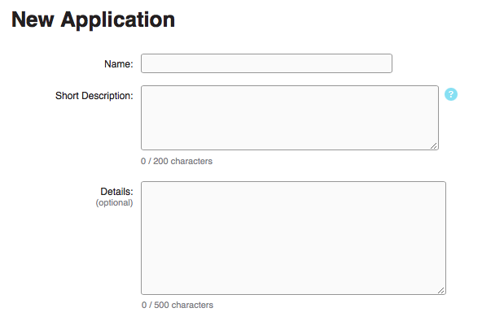

# Challenge. InfoJobs API

Create a mini-app that allow us to search for jobs using the infojobs API
The interface should be created w/ bootstrap and should be responsive
The mini app so

*You must logIn in to the developer site (use your InfoJobs account) and register your application to get the developer credentials*

- https://developer.infojobs.net/user/login/index

---

Create an app that:

- Make a simply HTML with one text field and a button
- This button should search job offers relacionate with it
- Show all the titles of job offers in a new HTML (As maximum, 20 offers).
- Show again the form for do other search
- You can now show more offers and the owner of it?

Resources:
- https://developer.infojobs.net/documentation/operation-list/index.xhtml#job-search
    + https://developer.infojobs.net/documentation/operation/offer-list-1.xhtml
