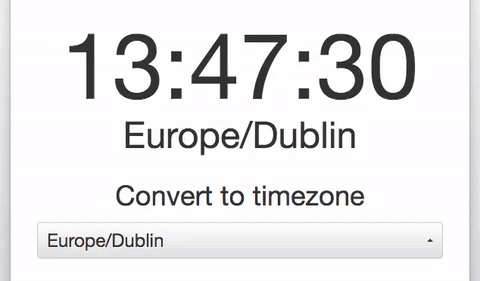

# Clock timezone

Create a clock (w/ Bootstrap & jQuery) that displays the current time in real time and also allow us to display the current time in a different timezone

Resources:

    - https://timezonedb.com/references/list-time-zone
    - http://pellepim.bitbucket.org/jstz/
    - http://momentjs.com/
    - http://momentjs.com/timezone/
    - https://silviomoreto.github.io/bootstrap-select/
