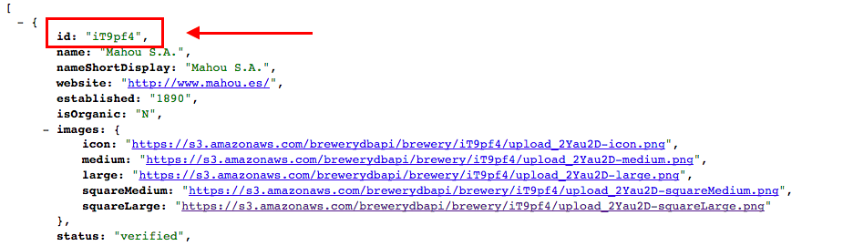

# Beers App

Create an app (w/ jQuery and Bootstrap) that reads the value entered by the user in an input an use this value to look for beers that matches that query using the following URL.

    https://quiet-inlet-67115.herokuapp.com/api/search/all?q=<%QUERY%>

For example, for `mahou` we can use the following URL (AJAX request) to get a list of beers that matches this value 

    https://quiet-inlet-67115.herokuapp.com/api/search/all?q=mahou

Every result (beer) has an id. 

We can use this ID to get more info about the beers using this other URL (AJAX request)

    https://quiet-inlet-67115.herokuapp.com/api/beer/<%ID-BEER%>

So, for example, for a beer ID `iT9pf4` we can get more info about this beer by going to 

    https://quiet-inlet-67115.herokuapp.com/api/beer/iT9pf4

The design of the app is up to you (but should be UX-friendly) and the user should be able (somehow) of looking for beers, getting a list of results and then getting more info over each beer by clicking on them

